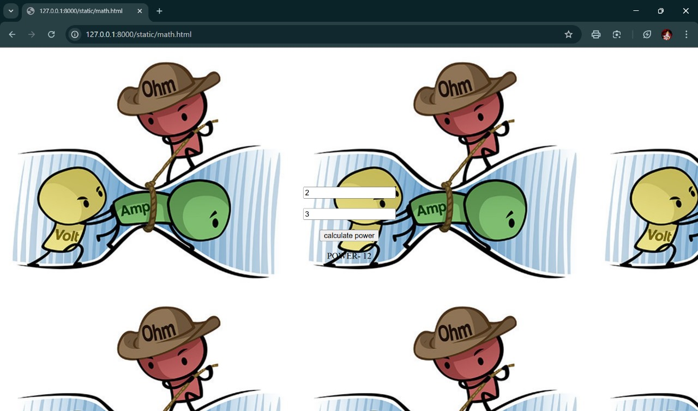

# Ex.05 Design a Website for Server Side Processing
## Date:27.11.24

## AIM:
 To design a website to calculate the power of a lamp filament in an incandescent bulb in the server side. 


## FORMULA:
P = I<sup>2</sup>R
<br> P --> Power (in watts)
<br> I --> Intensity
<br> R --> Resistance

## DESIGN STEPS:

### Step 1:
Clone the repository from GitHub.

### Step 2:
Create Django Admin project.

### Step 3:
Create a New App under the Django Admin project.

### Step 4:
Create python programs for views and urls to perform server side processing.

### Step 5:
Create a HTML file to implement form based input and output.

### Step 6:
Publish the website in the given URL.

## PROGRAM :
```
<html>
    <head><style>
    body{
        margin-top: 20%;
    }
    </style>
        <link rel="stylesheet" href="simple1.css">
        <script type="text/javascript">
            function check()
            {
                var x=Number(document.getElementById("ans1").value);
                var y=Number(document.getElementById("ans2").value);
                var p=x*x*y;
                document.getElementById("answer").innerText="POWER- "+ p;
                
            }

        </script>
    </head>
    <body background="C:\Users\admin\Downloads\Ohms-law-cartoon-cropped.jpg">
        <div>
            <center>
            <input type="text" placeholder="Enter Intensity" id="ans1"><br><br>
            <input type="text" placeholder="Enter Resistance" id="ans2"><br><br>
            <input type="button" onclick=" check()"; value="calculate power"><br><br>
            <label id="answer"></label>
        </div>
    </center>
    </body>
</html>
```


## SERVER SIDE PROCESSING:


## HOMEPAGE:


## RESULT:
The program for performing server side processing is completed successfully.
